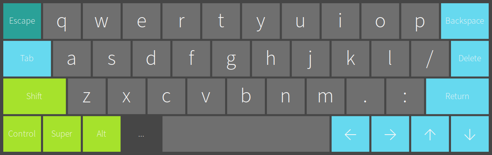
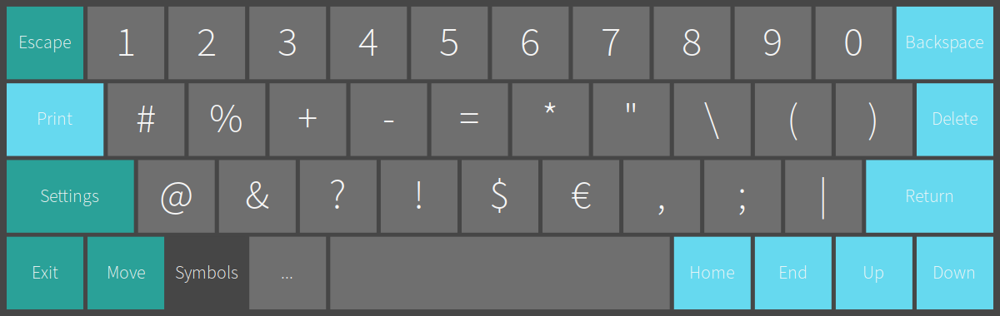
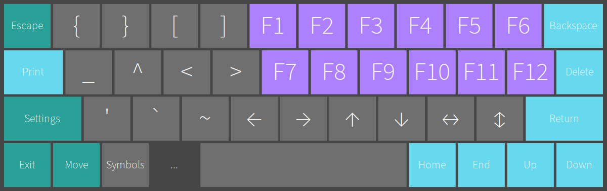

# Onboard Theme

Minimal theme for Onboard in flat design. Requires [Adobe Source Sans](https://github.com/adobe-fonts/source-sans).

## Installation

```
mkdir -p ~/.config/onboard/
cp ./config/onboard-defaults.conf ~/.config/onboard/

mkdir -p ~/.local/share/onboard/{layouts,themes}/
cp ./layouts/Flat.onboard ~/.local/share/onboard/layouts/
cp ./themes/Flat.colors ~/.local/share/onboard/themes/
cp ./themes/Flat.theme ~/.local/share/onboard/themes/

dconf reset -f /org/onboard/
```

## Screenshots






